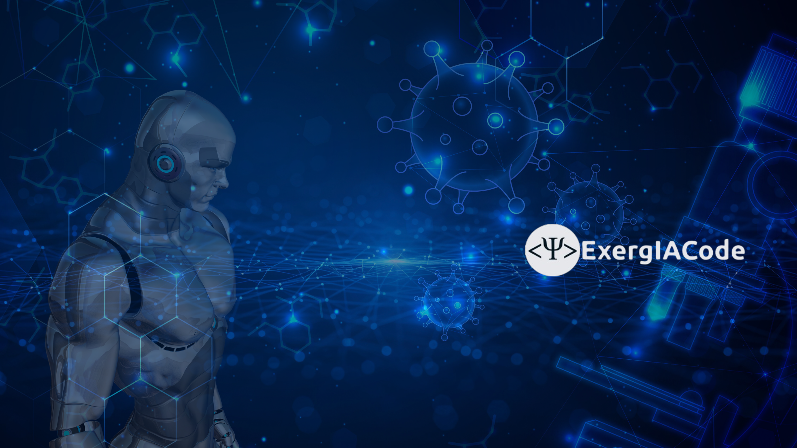

  

<!--
NiengLee/NiengLee is a ✨ special ✨ repository because its `README.md` (this file) appears on your GitHub profile.
You can click the Preview link to take a look at your changes.
-->

## Software Dev / Data Science / Machine Learning / IA Dev con enfoque en ingeniería química
Trabajo en construcción de APIs (interfaces de programación de aplicaciones), datos y modelos aplicados a problemas de ingeniería. Interés fuerte en backend, DevOps, desarrollo de modelos IA, seguridad.

## Objetivo del repositorio
Los avances tecnológicos impactan de forma transversal a las actividades económicas y a las distintas profesiones. En este contexto, resulta clave incorporar y comprender el uso de herramientas digitales en las áreas de ingeniería. Este repositorio tiene como propósito aplicar tecnologías informáticas actuales para desarrollar soluciones en ingeniería química y, al mismo tiempo, ofrecer una alternativa y apoyo a los procesos académicos universitarios en aquellos casos donde estas tecnologías aún no se han integrado plenamente.

### Enfoque software
- Backend: FastAPI, Django, PostgreSQL, Elasticsearch
- Data Science / ML: pandas, NumPy, scikit-learn, TensorFlow/PyTorch, Bokeh
- DevOps: Linux, Docker, NGINX, AWS, Git, GitHub Actions (CI/CD: integración continua/entrega continua)

### Enfoque Ingeniería química
- Termodinámica general
- Termodinámica en sistemas multicomponente/multifasico
- Termodinámica en sistemas reactivos y fenómenos de superficie
- Fenomenos de transporte
- Operaciones unitarias (Transferenca de cantidad de movimiento, calor y masa)

### Proyectos destacados
- Implementación de herramientas software para soluciones en ingeniería química.

### Metologías
- Buenas prácticas: tests, linting, tipado, documentación, PRs limpios
- Seguridad: manejo de secretos, control de acceso, hardening básico

### Contacto
- LinkedIn: linkedin.com/in/ncyl91/?locale=es_ES